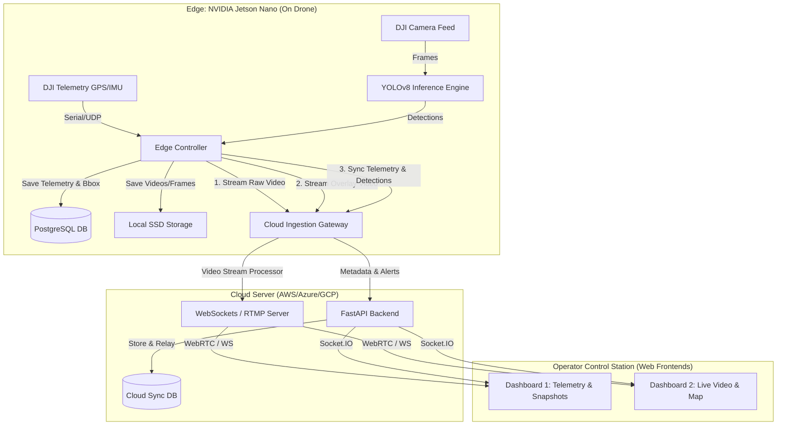

#  Drone-Based Sand Mining Detection  Edge-Cloud Architecture Design

This document details the end-to-end system architecture for detecting illegal sand mining activities. The architecture leverages a **DJI Drone** equipped with an **NVIDIA Jetson Nano** for edge-level AI inference and local data logging, synchronized with a **Cloud Backend** to power dual real-time operator dashboards.

---

## 1. System Architecture Overview



---

## 2. Edge System (Jetson Nano) Design

The Jetson Nano must remain functional and resilient even if cloud connectivity is lost or spotty. Therefore, all captured data, detections, and telemetry are stored locally before any cloud upload attempt.

### A. Local Storage & Database Schema (PostgreSQL)
We run a local **PostgreSQL** instance on the Jetson Nano. The local database tracks telemetry logs, object detections, and incident records.

```sql
-- Create database schema on Jetson Nano PostgreSQL

-- 1. Telemetry Log Table (recorded at e.g., 5-10 Hz)
CREATE TABLE telemetry_logs (
    id BIGSERIAL PRIMARY KEY,
    timestamp TIMESTAMPTZ NOT NULL DEFAULT NOW(),
    latitude DOUBLE PRECISION NOT NULL,
    longitude DOUBLE PRECISION NOT NULL,
    altitude_agl DOUBLE PRECISION NOT NULL, -- Altitude Above Ground Level (meters)
    gimbal_pitch DOUBLE PRECISION NOT NULL,  -- Gimbal vertical angle (degrees)
    gimbal_yaw DOUBLE PRECISION NOT NULL,    -- Gimbal horizontal angle (degrees)
    gimbal_roll DOUBLE PRECISION NOT NULL,   -- Gimbal roll angle (degrees)
    drone_speed DOUBLE PRECISION NOT NULL,   -- Speed in m/s
    battery_percentage INT NOT NULL,
    gps_accuracy_m DOUBLE PRECISION NOT NULL
);

-- 2. Detections Table (raw model outputs)
CREATE TABLE detections (
    id BIGSERIAL PRIMARY KEY,
    telemetry_log_id BIGINT REFERENCES telemetry_logs(id) ON DELETE SET NULL,
    timestamp TIMESTAMPTZ NOT NULL DEFAULT NOW(),
    class_name VARCHAR(50) NOT NULL,         -- 'truck', 'jcb', 'person'
    confidence DOUBLE PRECISION NOT NULL,
    bbox_x_min INT NOT NULL,                 -- Pixel bounding box coordinates
    bbox_y_min INT NOT NULL,
    bbox_x_max INT NOT NULL,
    bbox_y_max INT NOT NULL,
    latitude DOUBLE PRECISION,               -- Projected GPS Latitude
    longitude DOUBLE PRECISION,              -- Projected GPS Longitude
    frame_path VARCHAR(255)                  -- Local SSD file path of the frame
);

-- 3. Incidents / Activity Clusters Table (generated via DBSCAN)
CREATE TABLE incidents (
    id BIGSERIAL PRIMARY KEY,
    timestamp TIMESTAMPTZ NOT NULL DEFAULT NOW(),
    centroid_latitude DOUBLE PRECISION NOT NULL,
    centroid_longitude DOUBLE PRECISION NOT NULL,
    severity VARCHAR(20) NOT NULL,           -- 'CRITICAL', 'HIGH', 'MEDIUM', 'LOW'
    illegal_zone BOOLEAN NOT NULL DEFAULT TRUE,
    distance_to_river_m DOUBLE PRECISION,
    evidence_image_path VARCHAR(255),        -- Saved image showing the cluster
    synced_to_cloud BOOLEAN NOT NULL DEFAULT FALSE
);

-- Create indexes for spatial query optimization
CREATE INDEX idx_telemetry_time ON telemetry_logs (timestamp);
CREATE INDEX idx_detections_time ON detections (timestamp);
CREATE INDEX idx_incidents_coords ON incidents (centroid_latitude, centroid_longitude);
```

### B. Core Edge Software Services
We will organize the Jetson Nano application into distinct, parallel edge services:
1. **`telemetry_reader`**: Interacts with the DJI Onboard SDK (via serial/network connection) or acts as a simulated DJI Telemetry Server during development. Logs coordinates to PostgreSQL.
2. **`yolo_inference`**: Grabs frames from the camera, runs YOLOv8m (optimized using TensorRT or ONNX Runtime on the Jetson's Maxwell GPU), outputs detected coordinates, and generates an overlay frame (video feed with bounding boxes).
3. **`coordinate_projector`**: Takes bounding boxes + drone telemetry, calculates ground footprints, and projects the lat/long for each vehicle/person.
4. **`data_archiver`**: Saves cropped frames of detections and raw video files locally to SSD, logging their metadata in PostgreSQL.
5. **`cloud_sync_client`**: A background thread/process that monitors network availability (4G/5G dongle) and streams telemetry packets, detection events, raw/overlay video frames, and incident JSONs to the cloud.

---

## 3. Communication & Real-Time Streaming Protocols

To achieve low-latency real-time video and data delivery to the cloud, we will use a hybrid communication system:

| Stream Type | Protocol | Why We Choose It |
|---|---|---|
| **Raw Video Feed** | **WebRTC / RTSP-over-SRT** | Sub-second latency (100300ms). Resilient over fluctuating cellular networks (4G/5G). |
| **Annotated Video Feed (Detections)** | **WebRTC / RTSP-over-SRT** | Overlaid bounding boxes are drawn on the Jetson Nano, encoded, and streamed separately to avoid cloud rendering lag. |
| **Telemetry & Detections Metadata** | **WebSocket / Socket.IO** | Bi-directional, persistent TCP connection. Allows real-time delivery of GPS telemetry packets (10 Hz) and instant detection alerts. Supports retry buffers if offline. |

---

## 4. Cloud Ingestion & Dashboard Layouts

The cloud backend runs a **FastAPI** server that ingests telemetry, handles Socket.IO connections, manages incident databases, and relays feeds.

### Dashboard 1: Telemetry & Snapshot Explorer
* **Primary Operator View**: Tailored for legal enforcement, auditing, and historic record review.
* **Component Layout**:
  * **Telemetry Telemetry Cards**: Real-time speed, altitude, battery, signal strength, and current flight time.
  * **Critical Incident Queue**: A list of recently detected illegal mining clusters categorized by **Severity** (e.g., CRITICAL: JCB + Truck + Workers inside buffer zone).
  * **Snapshot Evidence Cards**: Visual grid containing cropped photos of detected trucks, excavators (JCBs), or individuals with timestamp, exact coordinates, and confidence level. Clicking a card opens the full annotated drone frame.
  * **Report Downloader**: Fast PDF generation for individual incidents to share with local authorities.

### Dashboard 2: Real-Time Stream & Live Mapping
* **Tactical Command View**: Tailored for real-time mission tracking and pilot navigation monitoring.
* **Component Layout**:
  * **Dual Live Feed Panels**:
    * **Panel A**: Raw, high-resolution feed directly from the drone camera.
    * **Panel B**: Live feed with YOLO bounding boxes, class labels, real-time confidence scores, GPS coordinates overlay, and GMT/Local timestamps.
  * **Interactive Google Map / Leaflet Map**:
    * Displays the pre-calculated **0.5 km Blue Buffer Zone** around the river boundary.
    * Displays the **Drone's Real-time Flight Path** (updated live via WebSocket telemetry).
    * Dynamic **Marker Pins**: Red/yellow warning markers that drop on the map in real-time as soon as a cluster is identified, showing immediate detail on hover.
  * **Real-time Alert Bar**: Instant sound/flashing alerts when a machine is detected inside the illegal river zone.

---

## 5. Next Steps & Development Roadmap

1. **Setup Edge Local database**: Add SQLite/PostgreSQL configuration logic in our project.
2. **Implement Edge Inference & Tracker**: Write `src/detection/detector.py` to run YOLOv8, draw overlays, and estimate GPS coordinates using telemetry.
3. **Build the FastAPI Cloud Backend**: Implement WebSockets/Socket.IO communication in `src/dashboard/app.py` to handle both telemetry routing and frame uploads.
4. **Develop Dashboards 1 & 2**: Implement the web frontends with real-time video canvas, telemetry gauges, and Leaflet/Google Maps.
