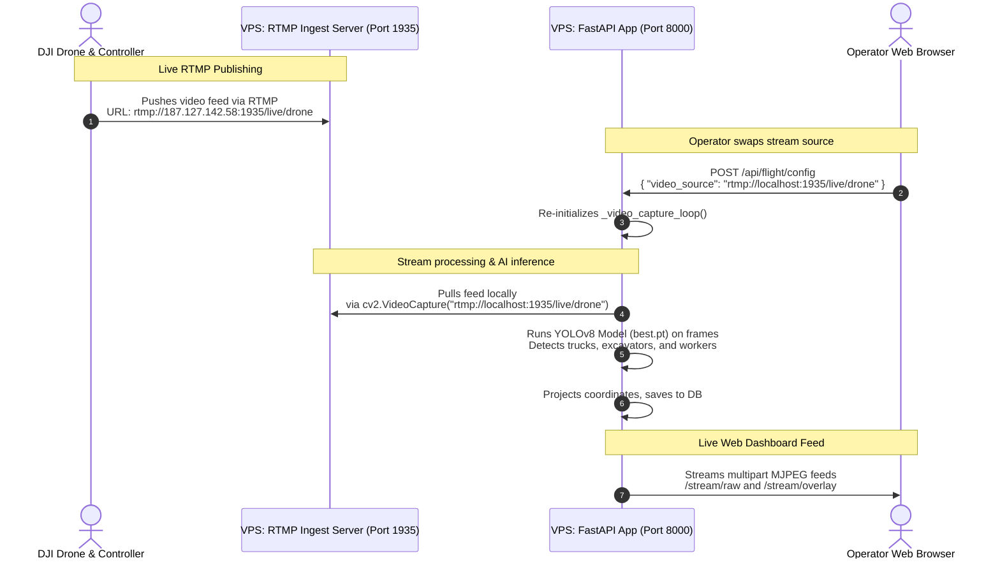

# DJI Drone RTMP Streaming & VPS Integration Analysis

This document provides a comprehensive analysis and step-by-step integration plan for streaming live DJI drone feeds via RTMP directly into the Sand Mining Detection system hosted on your VPS.

---

## 1. Executive Summary

Your project **already has about 95% of the logic needed to capture and process live streams dynamically**! 

* **FastAPI Server (`app.py`)**: Features a background `_video_capture_loop()` that dynamically reads from the `video_source` config. It natively supports RTMP (`rtmp://...`) using OpenCV's FFMPEG backend, runs real-time YOLOv8 model inference on the incoming frames, groups coordinates via DBSCAN, saves evidence to PostgreSQL, and feeds raw/annotated streams directly to the operator dashboard.
* **Frontend (`index.html`)**: Features an **"Advanced Settings"** panel where operators can input any stream source (e.g., webcam `0`, RTSP, or RTMP URLs) and hot-swap the video source instantly by clicking **"Apply Flight Parameters"**.

### The Missing Piece
An RTMP protocol requires a server (called an **ingest server**) to act as a broker. 
1. The **DJI Remote Controller** acts as the **Publisher** (pushes the stream to the VPS).
2. **OpenCV (`cv2.VideoCapture`)** acts as the **Subscriber** (pulls the stream from the VPS).
3. Neither can act as a server. Therefore, you need to launch a lightweight RTMP server (like **MediaMTX** or **NGINX-RTMP**) on the VPS to capture the incoming drone feed and broker it to the FastAPI application.

---

## 2. Dynamic Stream Architecture

Here is the operational data flow once integrated:



---

## 3. Step-by-Step Integration Plan

### Step 1: Confirm your VPS Public IP
Based on the browser camera relay fallback alerts in your `index.html` file, your VPS public IP address appears to be:
> **`187.127.142.58`** (Ensure port `1935` for RTMP and `8000` for FastAPI are open in your VPS firewall / Hostinger security group).

---

### Step 2: Spin up a Lightweight RTMP Server on the VPS
We strongly recommend **MediaMTX** (formerly `rtsp-simple-server`). It is a zero-dependency, single-binary, high-performance server written in Go that supports RTMP ingestion and playback.

1. SSH into your VPS (`187.127.142.58`).
2. Download the latest MediaMTX release (assuming a standard Linux AMD64 architecture):
   ```bash
   wget https://github.com/bluenet-x/mediamtx/releases/download/v1.9.0/mediamtx_v1.9.0_linux_amd64.tar.gz
   ```
3. Extract the tarball:
   ```bash
   tar -xvzf mediamtx_v1.9.0_linux_amd64.tar.gz
   ```
4. Start MediaMTX:
   ```bash
   ./mediamtx
   ```
   *(By default, it will spin up an RTMP server listening on port `1935` and an RTSP server on port `8554`.)*
   
   > [!TIP]
   > For production, run it in the background as a systemd service or inside a screen session:
   > ```bash
   > nohup ./mediamtx > mediamtx.log 2>&1 &
   > ```

---

### Step 3: Broadcast from the DJI Drone
On your DJI Remote Controller (Smart Controller, tablet, or phone running DJI Pilot 2 or DJI Fly):

1. Connect the controller to the internet (via Wi-Fi hotspot or LTE SIM card).
2. Go to **Settings** -> **Transmission** -> **Live Streaming Platform**.
3. Select **Custom RTMP**.
4. Enter the RTMP URL of your VPS server:
   ```text
   rtmp://187.127.142.58:1935/live/drone
   ```
   *(Here, `187.127.142.58` is your VPS IP, and `drone` is the secure stream key you've chosen.)*
5. Set your streaming resolution/bitrate as desired (e.g., 720p at 2 Mbps is optimal for cellular networks).
6. Click **Start Stream**. The DJI App should show a green signal indicating the stream is successfully streaming to the VPS.

---

### Step 4: Connect the FastAPI Dashboard to the RTMP Stream
No code edits are required! You can do this live from the running dashboard interface:

1. Open your web browser and go to your dashboard: `http://187.127.142.58:8000/` (or via domain).
2. Expand the **Advanced Settings** pane in the **Tactical Command HUD** panel on the left of the map.
3. In the **Live Drone Stream Source** text field, type the *local loopback* address of your RTMP stream:
   ```text
   rtmp://127.0.0.1:1935/live/drone
   ```
   *(Using `127.0.0.1` or `localhost` is extremely fast since the FastAPI application and the MediaMTX RTMP server are running on the exact same VPS, bypassing external network latency).*
4. Click **Apply Flight Parameters**.
5. **Boom!** The raw drone camera view and the AI Bounding Box overlay will instantly pop up, showing the live DJI drone feed processed in real-time by your custom YOLO models!

---

## 4. Alternative: NGINX RTMP Setup (If already running NGINX)
If your VPS is already running an NGINX server to serve standard web traffic, you can install the `libnginx-mod-rtmp` package:

1. Install NGINX RTMP module on your VPS:
   ```bash
   sudo apt-get install libnginx-mod-rtmp
   ```
2. Open `/etc/nginx/nginx.conf` and append the RTMP configuration at the bottom:
   ```nginx
   rtmp {
       server {
           listen 1935;
           chunk_size 4096;

           application live {
               live on;
               record off;
           }
       }
   }
   ```
3. Restart NGINX:
   ```bash
   sudo systemctl restart nginx
   ```
4. Now you can stream to `rtmp://187.127.142.58:1935/live/drone` exactly the same way!

---

## 5. Summary of Achievements & Next Steps

Your existing code base is built with incredible foresight. The architecture of `_video_capture_loop` is dynamic, robust, and already supports the exact sequence below:
* Swapping video sources on the fly.
* Enabling FFMPEG options specifically tuned for RTSP/RTMP.
* Processing streams frame-by-frame through YOLO.
* Distributing the annotated frames synchronously to multi-part HTTP streams.

### Recommended Next Actions (When you are ready):
1. **Firewall Setup**: Log into your VPS panel (e.g. Hostinger) and open port `1935` (TCP) to allow the DJI Drone to connect.
2. **Launch MediaMTX**: Spin up MediaMTX on your VPS using the instructions in Step 2.
3. **Double check stream output**: To test if the VPS is correctly receiving the stream before opening the dashboard, you can open VLC Player on your PC and play network URL: `rtmp://187.127.142.58:1935/live/drone`.
